<div align="center">

<p>
  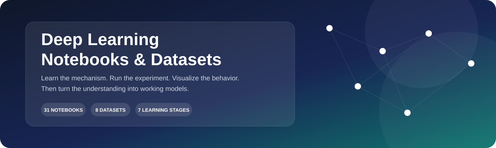
</p>

# Deep Learning Notebooks & Datasets

### A structured, visual, hands-on deep learning laboratory

<p>
  <a href="https://github.com/RITESH2127/Deep-learning-notebooks-and-datasets">
    
  </a>
  <a href="https://github.com/RITESH2127/Deep-learning-notebooks-and-datasets/actions/workflows/validate-repository.yml">
    
  </a>
  
  
  
  
  
</p>

<p>
  <strong>31 notebooks</strong> · <strong>8 datasets</strong> · <strong>7 learning stages</strong> · <strong>visual experiments</strong> · <strong>automated validation</strong>
</p>

<p>
  <a href="#start-here">Start Here</a> ·
  <a href="#notebook-atlas">Notebook Atlas</a> ·
  <a href="#visual-data-atlas">Visual Atlas</a> ·
  <a href="#dataset-directory">Datasets</a> ·
  <a href="#run-it">Run It</a> ·
  <a href="#repository-engineering">Engineering</a>
</p>

</div>

> **Core idea:** do not memorize deep learning as a list of APIs. Build intuition from first principles, verify it with experiments, visualize what changes, and then apply the idea to real models.

---

---

## What is this repository?

This repository is a **hands-on deep learning laboratory** built around executable Jupyter notebooks and supporting datasets.

Instead of treating deep learning as a collection of black-box APIs, the notebooks explore the ideas that make neural networks work:

- **Neural-network fundamentals**
- **Gradient descent and optimization**
-  **Initialization and training dynamics**
-  **Regularization and generalization**
- **Multilayer perceptrons**
-  **Convolutional neural networks**
-  **Image classification and augmentation**
- **Transfer learning**
-  **Functional neural-network architectures**
- **Applied machine-learning workflows**

> **Learning principle:** understand the mechanism -> implement it -> visualize its behavior -> use it in a model.

---

## Repository at a glance

| Component | Current contents |
|:---|---:|
| Jupyter notebooks | **31** |
|  CSV datasets | **8** |
|  Image assets | **2** |
| Total tracked files | **46** |
| Core learning tracks | **7** |
|  Primary ecosystem | **Python + TensorFlow/Keras + NumPy** |

### The learning curve

**Foundations** -> **Optimization** -> **Training** -> **Generalization** -> **CNNs** -> **Transfer Learning** -> **Applied Deep Learning**

---

## Start Here

If you are opening this repository for the first time, use this order:

| Goal | Open |
|:---|:---|
| Follow the complete curriculum | [Structured Learning Path](./docs/LEARNING_PATH.md) |
| Start from first principles | [Perceptron](./Perceptron.ipynb) → [Neural Network from Scratch](./neural_network_scratch.ipynb) |
| Understand learning | [Backpropagation](./backpropagation_classification.ipynb) → [Gradient Descent](./Batch_vs_stochastic_GD.ipynb) → [Optimizers](./Optimizers.ipynb) |
| Understand training failures | [Vanishing Gradients](./vanishing_gradient.ipynb) → [Initialization](./Xavier_and_He.ipynb) → [Batch Normalization](./batch_norm_example.ipynb) |
| Learn CNNs | [CNN from Scratch](./CNN_from_scratch.ipynb) → [LeNet-5](./LENET5_CNN.ipynb) → [Image Classification](./ImageClassifierCNN.ipynb) |
| Learn transfer learning | [VGG16](./transfer_learning_VGG16.ipynb) → [ImageNet](./pre_trained_imagenet_and_plots.ipynb) |
| See applied models | [MNIST](./MNIST_digits_MLP.ipynb) · [Regression](./Regression_MLP.ipynb) · [Customer Churn](./CustomerChurnPredictionMLP.ipynb) |

### The learning loop

```text
Concept → Predict → Implement → Visualize → Experiment → Explain → Build
```

## Learning Architecture

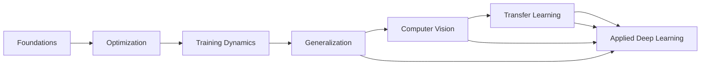

The repository follows a deliberate progression: first understand how neural networks work, then understand how they learn, then control training behavior, and finally apply the ideas to vision and real datasets.

---

## The learning tracks

| Track | What you learn | Representative notebooks |
|:---|:---|:---|
| **01 Foundations** | Perceptrons, neural networks, backpropagation | Perceptron, neural_network_scratch, backpropagation_* |
| **02 Optimization** | Gradient descent, optimizers, EWMA, optimization geometry | Batch_vs_stochastic_GD, Optimizers, EWMA |
| **03 Training** | Scaling, initialization, batch normalization, gradient behavior | feature_scaling, Xavier_and_He, batch_norm_example |
| **04 Generalization** | Regularization, dropout, early stopping, hyperparameter tuning | regularizationNN, dropout_classification, early_stopping |
| **05 Vision** | Convolution, pooling, padding, strides, CNN architectures | CNN_from_scratch, LENET5_CNN, ImageClassifierCNN |
| **06 Transfer & Applied DL** | VGG16, ImageNet, MLP applications and functional APIs | transfer_learning_VGG16, pre_trained_imagenet_and_plots |

---

## What You Will Learn

This repository is designed as a progressive learning path rather than a random notebook collection.

| Stage | Core question | Main topics |
|:---|:---|:---|
| **1. Foundations** | How does a neural network make a prediction? | Perceptron, neurons, forward propagation, backpropagation |
| **2. Optimization** | How does a model learn its parameters? | Gradient descent, stochastic updates, optimizers, optimization geometry |
| **3. Training Dynamics** | Why does training succeed or fail? | Feature scaling, initialization, batch normalization, vanishing gradients |
| **4. Generalization** | How do we prevent memorization? | Regularization, dropout, early stopping, hyperparameter tuning |
| **5. Computer Vision** | How can neural networks understand images? | Convolution, padding, stride, pooling, CNN architectures, augmentation |
| **6. Transfer Learning** | How can pretrained knowledge be reused? | VGG16, ImageNet, pretrained representations |
| **7. Applied Deep Learning** | How do these ideas become practical models? | MNIST, regression, customer churn |

### Recommended first-time path

**Perceptron → Neural Network from Scratch → Backpropagation → Gradient Descent → Optimizers → Initialization → Batch Normalization → Regularization → CNN → LeNet-5 → Image Classification → Transfer Learning → Applied Models**

---
# Notebook Atlas

> **Tip:** Every notebook can be opened directly from the tables below. The **Colab** links use the repository's current main branch.

## 01 | Neural Network Foundations

| Notebook | What it explores | Launch |
|:---|:---|:---:|
| [Perceptron.ipynb](./Perceptron.ipynb) | Single-neuron classification and perceptron learning | [Open Colab](https://colab.research.google.com/github/RITESH2127/Deep-learning-notebooks-and-datasets/blob/main/Perceptron.ipynb) |
| [Problem_with_perceptron.ipynb](./Problem_with_perceptron.ipynb) | Where a single perceptron breaks down | [Open Colab](https://colab.research.google.com/github/RITESH2127/Deep-learning-notebooks-and-datasets/blob/main/Problem_with_perceptron.ipynb) |
| [neural_network_scratch.ipynb](./neural_network_scratch.ipynb) | Neural-network mechanics without hiding the fundamentals | [Open Colab](https://colab.research.google.com/github/RITESH2127/Deep-learning-notebooks-and-datasets/blob/main/neural_network_scratch.ipynb) |
| [backpropagation_classification.ipynb](./backpropagation_classification.ipynb) | Backpropagation for classification | [Open Colab](https://colab.research.google.com/github/RITESH2127/Deep-learning-notebooks-and-datasets/blob/main/backpropagation_classification.ipynb) |
| [backpropagation_regression.ipynb](./backpropagation_regression.ipynb) | Backpropagation for regression | [Open Colab](https://colab.research.google.com/github/RITESH2127/Deep-learning-notebooks-and-datasets/blob/main/backpropagation_regression.ipynb) |

---

## 02 | Optimization & Gradient Descent

| Notebook | What it explores | Launch |
|:---|:---|:---:|
| [Batch_vs_stochastic_GD.ipynb](./Batch_vs_stochastic_GD.ipynb) | Batch vs. stochastic gradient descent | [Open Colab](https://colab.research.google.com/github/RITESH2127/Deep-learning-notebooks-and-datasets/blob/main/Batch_vs_stochastic_GD.ipynb) |
| [Optimizers.ipynb](./Optimizers.ipynb) | Optimization strategies used during neural-network training | [Open Colab](https://colab.research.google.com/github/RITESH2127/Deep-learning-notebooks-and-datasets/blob/main/Optimizers.ipynb) |
| [EWMA.ipynb](./EWMA.ipynb) | Exponentially weighted moving averages | [Open Colab](https://colab.research.google.com/github/RITESH2127/Deep-learning-notebooks-and-datasets/blob/main/EWMA.ipynb) |
| [elongated_bowl_problem.ipynb](./elongated_bowl_problem.ipynb) | Intuition for optimization landscapes and gradient-based movement | [Open Colab](https://colab.research.google.com/github/RITESH2127/Deep-learning-notebooks-and-datasets/blob/main/elongated_bowl_problem.ipynb) |

---

## 03 | Training Dynamics

| Notebook | What it explores | Launch |
|:---|:---|:---:|
| [feature_scaling.ipynb](./feature_scaling.ipynb) | Why input scaling matters during training | [Open Colab](https://colab.research.google.com/github/RITESH2127/Deep-learning-notebooks-and-datasets/blob/main/feature_scaling.ipynb) |
| [Xavier_and_He.ipynb](./Xavier_and_He.ipynb) | Xavier and He weight initialization | [Open Colab](https://colab.research.google.com/github/RITESH2127/Deep-learning-notebooks-and-datasets/blob/main/Xavier_and_He.ipynb) |
| [batch_norm_example.ipynb](./batch_norm_example.ipynb) | Batch normalization in neural networks | [Open Colab](https://colab.research.google.com/github/RITESH2127/Deep-learning-notebooks-and-datasets/blob/main/batch_norm_example.ipynb) |
| [vanishing_gradient.ipynb](./vanishing_gradient.ipynb) | Vanishing-gradient behavior | [Open Colab](https://colab.research.google.com/github/RITESH2127/Deep-learning-notebooks-and-datasets/blob/main/vanishing_gradient.ipynb) |
| [zero_initialization_sigmoid.ipynb](./zero_initialization_sigmoid.ipynb) | Zero initialization and sigmoid-based training behavior | [Open Colab](https://colab.research.google.com/github/RITESH2127/Deep-learning-notebooks-and-datasets/blob/main/zero_initialization_sigmoid.ipynb) |

---

## 04 | Regularization & Model Design

| Notebook | What it explores | Launch |
|:---|:---|:---:|
| [regularizationNN.ipynb](./regularizationNN.ipynb) | Regularization techniques for neural networks | [Open Colab](https://colab.research.google.com/github/RITESH2127/Deep-learning-notebooks-and-datasets/blob/main/regularizationNN.ipynb) |
| [dropout_classification.ipynb](./dropout_classification.ipynb) | Dropout for classification | [Open Colab](https://colab.research.google.com/github/RITESH2127/Deep-learning-notebooks-and-datasets/blob/main/dropout_classification.ipynb) |
| [early_stopping.ipynb](./early_stopping.ipynb) | Early stopping as a training-control technique | [Open Colab](https://colab.research.google.com/github/RITESH2127/Deep-learning-notebooks-and-datasets/blob/main/early_stopping.ipynb) |
| [HyperParamterTuning.ipynb](./HyperParamterTuning.ipynb) | Hyperparameter experimentation and model tuning | [Open Colab](https://colab.research.google.com/github/RITESH2127/Deep-learning-notebooks-and-datasets/blob/main/HyperParamterTuning.ipynb) |
| [functional_api_demo.ipynb](./functional_api_demo.ipynb) | Keras Functional API | [Open Colab](https://colab.research.google.com/github/RITESH2127/Deep-learning-notebooks-and-datasets/blob/main/functional_api_demo.ipynb) |
| [non_sequential_model_functionalAPI.ipynb](./non_sequential_model_functionalAPI.ipynb) | Non-sequential model construction | [Open Colab](https://colab.research.google.com/github/RITESH2127/Deep-learning-notebooks-and-datasets/blob/main/non_sequential_model_functionalAPI.ipynb) |

---

## 05 | Convolutional Neural Networks

| Notebook | What it explores | Launch |
|:---|:---|:---:|
| [CNN_from_scratch.ipynb](./CNN_from_scratch.ipynb) | CNN mechanics implemented from the ground up | [Open Colab](https://colab.research.google.com/github/RITESH2127/Deep-learning-notebooks-and-datasets/blob/main/CNN_from_scratch.ipynb) |
| [padding_and_strides_CNN.ipynb](./padding_and_strides_CNN.ipynb) | Padding and stride behavior | [Open Colab](https://colab.research.google.com/github/RITESH2127/Deep-learning-notebooks-and-datasets/blob/main/padding_and_strides_CNN.ipynb) |
| [pooling_CNN.ipynb](./pooling_CNN.ipynb) | Pooling operations | [Open Colab](https://colab.research.google.com/github/RITESH2127/Deep-learning-notebooks-and-datasets/blob/main/pooling_CNN.ipynb) |
| [LENET5_CNN.ipynb](./LENET5_CNN.ipynb) | LeNet-5 architecture | [Open Colab](https://colab.research.google.com/github/RITESH2127/Deep-learning-notebooks-and-datasets/blob/main/LENET5_CNN.ipynb) |
| [ImageClassifierCNN.ipynb](./ImageClassifierCNN.ipynb) | CNN-based image classification workflow | [Open Colab](https://colab.research.google.com/github/RITESH2127/Deep-learning-notebooks-and-datasets/blob/main/ImageClassifierCNN.ipynb) |
| [ImageDataGenerator.ipynb](./ImageDataGenerator.ipynb) | Image data generation and augmentation | [Open Colab](https://colab.research.google.com/github/RITESH2127/Deep-learning-notebooks-and-datasets/blob/main/ImageDataGenerator.ipynb) |

---

## 06 | Transfer Learning & Pretrained Models

| Notebook | What it explores | Launch |
|:---|:---|:---:|
| [transfer_learning_VGG16.ipynb](./transfer_learning_VGG16.ipynb) | Transfer learning with VGG16 | [Open Colab](https://colab.research.google.com/github/RITESH2127/Deep-learning-notebooks-and-datasets/blob/main/transfer_learning_VGG16.ipynb) |
| [pre_trained_imagenet_and_plots.ipynb](./pre_trained_imagenet_and_plots.ipynb) | Pretrained ImageNet models and visual analysis | [Open Colab](https://colab.research.google.com/github/RITESH2127/Deep-learning-notebooks-and-datasets/blob/main/pre_trained_imagenet_and_plots.ipynb) |

---

## 07 | Applied Neural Networks

| Notebook | What it explores | Launch |
|:---|:---|:---:|
| [MNIST_digits_MLP.ipynb](./MNIST_digits_MLP.ipynb) | MLP-based handwritten-digit classification | [Open Colab](https://colab.research.google.com/github/RITESH2127/Deep-learning-notebooks-and-datasets/blob/main/MNIST_digits_MLP.ipynb) |
| [Regression_MLP.ipynb](./Regression_MLP.ipynb) | MLP for regression | [Open Colab](https://colab.research.google.com/github/RITESH2127/Deep-learning-notebooks-and-datasets/blob/main/Regression_MLP.ipynb) |
| [CustomerChurnPredictionMLP.ipynb](./CustomerChurnPredictionMLP.ipynb) | Customer churn prediction using an MLP | [Open Colab](https://colab.research.google.com/github/RITESH2127/Deep-learning-notebooks-and-datasets/blob/main/CustomerChurnPredictionMLP.ipynb) |

---

## Visual Data Atlas

Every dataset in the repository now has a dedicated, repository-hosted visualization. These charts make the feature relationships, class structure, trends, and major patterns easier to inspect before opening the corresponding notebook.

### Repository overview

<p align="center">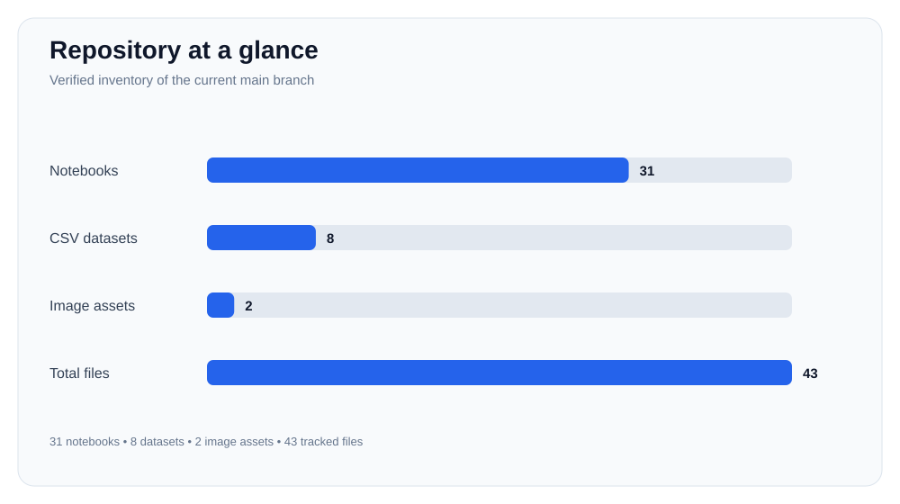</p>

### Notebook coverage

<p align="center"></p>

### Dataset gallery

| Dataset | Visualization | Primary view |
|:---|:---:|:---|
| [Admission_Predict_Ver1.1.csv](./Admission_Predict_Ver1.1.csv) | [View chart](./visualizations/Admission_Predict_Ver1.1.svg) | GRE score vs chance of admission |
| [Churn_Modelling.csv](./Churn_Modelling.csv) | [View chart](./visualizations/Churn_Modelling.svg) | Churn rate by geography |
| [DailyDelhiClimate.csv](./DailyDelhiClimate.csv) | [View chart](./visualizations/DailyDelhiClimate.svg) | Mean temperature across the full time series |
| [Social_Network_Ads.csv](./Social_Network_Ads.csv) | [View chart](./visualizations/Social_Network_Ads.svg) | Age vs estimated salary by purchase outcome |
| [car_prices.csv](./car_prices.csv) | [View chart](./visualizations/car_prices.svg) | Mileage vs selling price |
| [concertriccir2.csv](./concertriccir2.csv) | [View chart](./visualizations/concertriccir2.svg) | Two-dimensional class geometry |
| [diabetes.csv](./diabetes.csv) | [View chart](./visualizations/diabetes.svg) | Glucose vs BMI by outcome |
| [ushape.csv](./ushape.csv) | [View chart](./visualizations/ushape.svg) | Two-dimensional U-shaped class geometry |

### Dataset previews

<p align="center">
  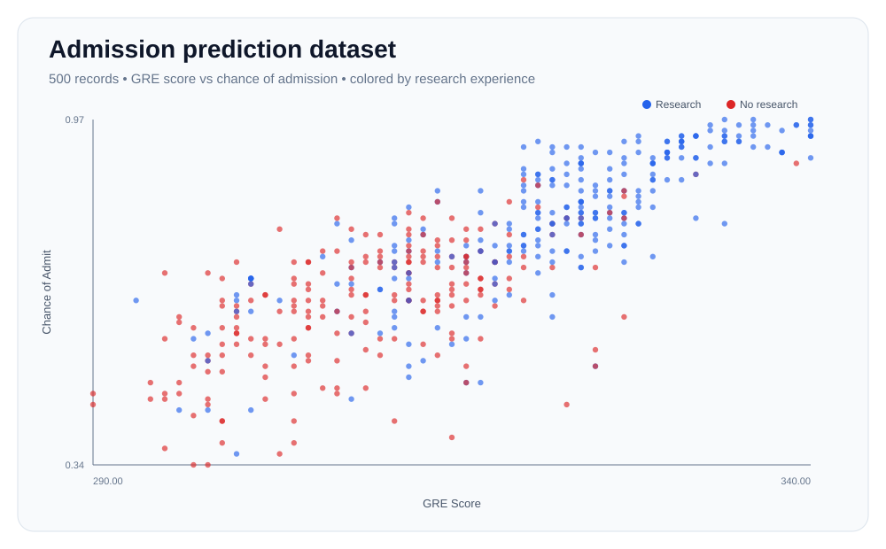
  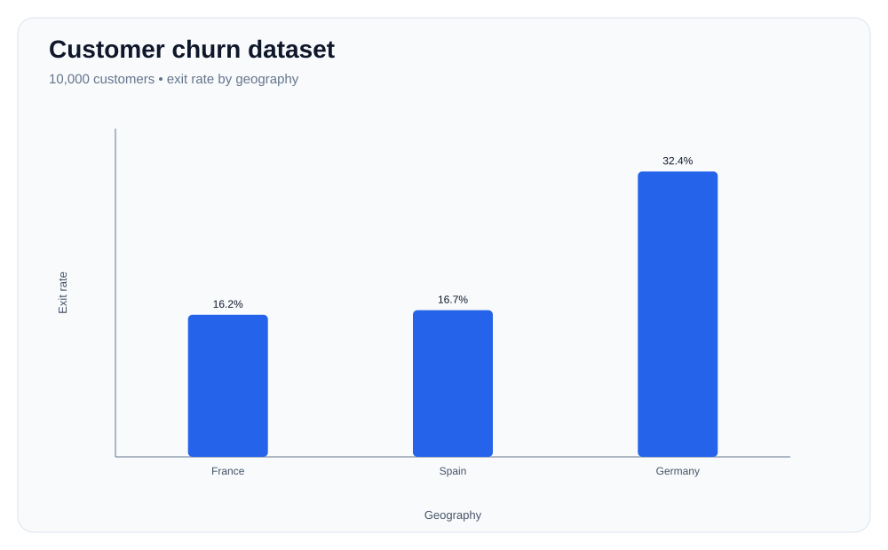
</p>
<p align="center">
  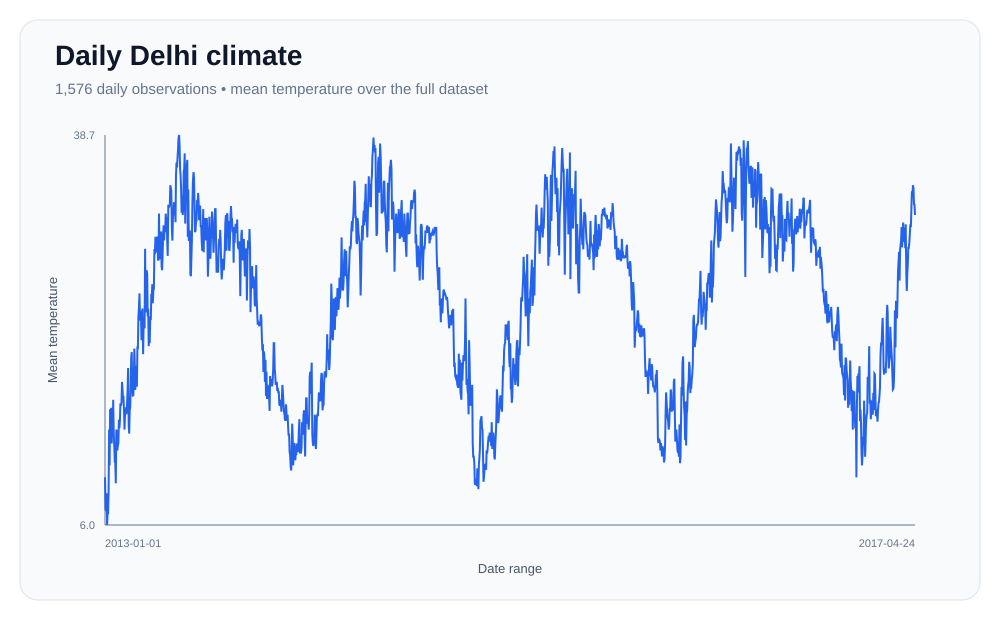
  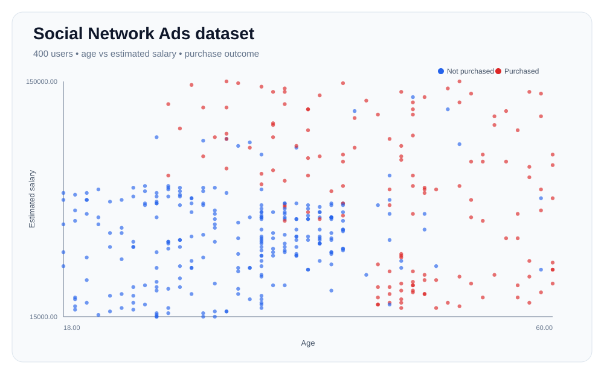
</p>
<p align="center">
  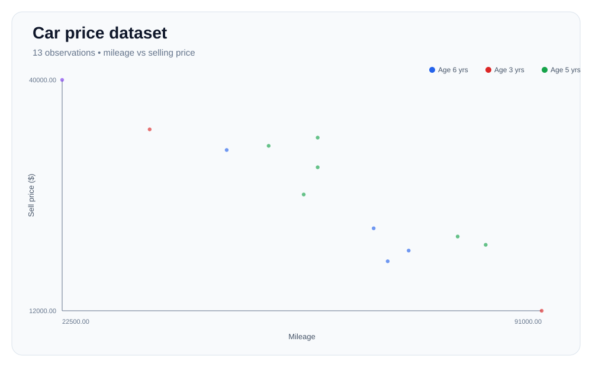
  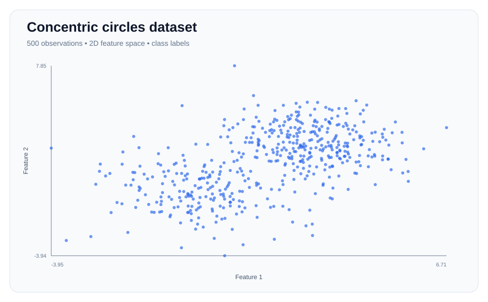
</p>
<p align="center">
  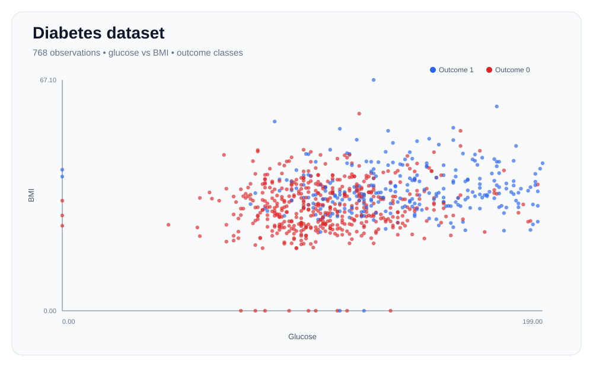
  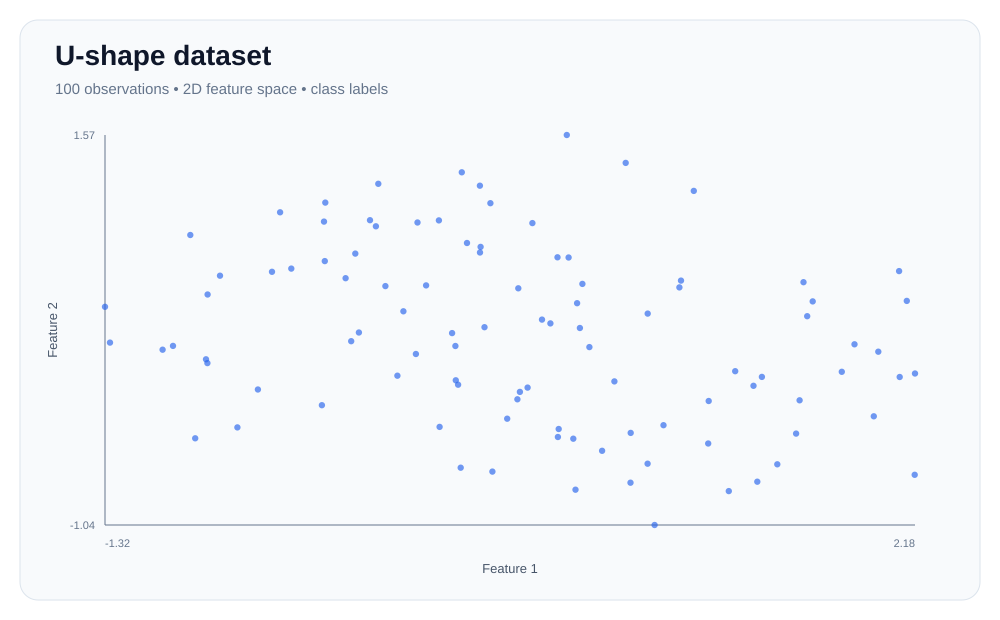
</p>

> The visualizations are descriptive views of the files stored in this repository. They are intended for exploration and learning, not as standalone statistical conclusions.

---

## Dataset Directory

The repository contains eight CSV datasets covering classification, regression, nonlinear decision boundaries, and time-series experimentation.

| Dataset | Rows | Columns | Primary target / signal | Learning use |
|:---|---:|---:|:---|:---|
| [Admission_Predict_Ver1.1.csv](./Admission_Predict_Ver1.1.csv) | 500 | 9 | Chance of Admit | Regression / prediction |
| [Churn_Modelling.csv](./Churn_Modelling.csv) | 10,000 | 14 | Exited | Binary classification |
| [DailyDelhiClimate.csv](./DailyDelhiClimate.csv) | 1,576 | 5 | Mean temperature / climate variables | Time-series exploration |
| [Social_Network_Ads.csv](./Social_Network_Ads.csv) | 400 | 5 | Purchased | Binary classification |
| [car_prices.csv](./car_prices.csv) | 13 | 5 | Sell Price | Regression |
| [concertriccir2.csv](./concertriccir2.csv) | 499 | 2 | Class geometry | Nonlinear classification |
| [diabetes.csv](./diabetes.csv) | 768 | 9 | Outcome | Binary classification |
| [ushape.csv](./ushape.csv) | 99 | 2 | Class geometry | Nonlinear classification |

> Row and column counts reflect the repository files currently tracked on the main branch. Dataset interpretation is provided for learning and navigation.

### Data workflow

```text
Raw Dataset
    ↓
Inspect Structure
    ↓
Visualize Relationships
    ↓
Preprocess / Scale
    ↓
Train Model
    ↓
Evaluate Metrics
    ↓
Interpret Results
```

---

## Visual Assets

The repository also contains two image assets used by selected notebooks:

- [doggo.jpg](./doggo.jpg)
- [kitty-cat-kitten-pet-45201.jpeg](./kitty-cat-kitten-pet-45201.jpeg)

---

# Concept Map

The repository uses a GitHub-compatible Mermaid flowchart instead of a Mermaid mindmap. This avoids the rendering issue caused by unindented sibling nodes and gives each concept an explicit parent relationship.

```mermaid
flowchart TD
    A["Deep Learning Lab"]

    A --> B["Foundations"]
    B --> B1["Perceptron"]
    B --> B2["Neural Network"]
    B --> B3["Backpropagation"]

    A --> C["Optimization"]
    C --> C1["Gradient Descent"]
    C --> C2["Optimizers"]
    C --> C3["EWMA"]
    C --> C4["Optimization Geometry"]

    A --> D["Training Dynamics"]
    D --> D1["Feature Scaling"]
    D --> D2["Xavier Initialization"]
    D --> D3["He Initialization"]
    D --> D4["Batch Normalization"]
    D --> D5["Vanishing Gradients"]
    D --> D6["Zero Initialization"]

    A --> E["Generalization and Model Design"]
    E --> E1["Regularization"]
    E --> E2["Dropout"]
    E --> E3["Early Stopping"]
    E --> E4["Hyperparameter Tuning"]
    E --> E5["Sequential Models"]
    E --> E6["Functional API"]
    E --> E7["Non-Sequential Models"]

    A --> F["Computer Vision"]
    F --> F1["Convolution"]
    F --> F2["Pooling"]
    F --> F3["Padding"]
    F --> F4["Strides"]
    F --> F5["LeNet-5"]
    F --> F6["Image Classification"]
    F --> F7["Image Data Generation"]

    A --> G["Transfer Learning"]
    G --> G1["VGG16"]
    G --> G2["ImageNet"]
    G --> G3["Pre-trained Models"]

    A --> H["Applied Neural Networks"]
    H --> H1["MNIST"]
    H --> H2["Regression"]
    H --> H3["Customer Churn"]

    classDef root fill:#0f172a,color:#ffffff,stroke:#0f172a,stroke-width:2px;
    classDef group fill:#e2e8f0,color:#0f172a,stroke:#64748b,stroke-width:1.5px;
    classDef topic fill:#ffffff,color:#334155,stroke:#94a3b8,stroke-width:1px;

    class A root;
    class B,C,D,E,F,G,H group;
    class B1,B2,B3,C1,C2,C3,C4,D1,D2,D3,D4,D5,D6,E1,E2,E3,E4,E5,E6,E7,F1,F2,F3,F4,F5,F6,F7,G1,G2,G3,H1,H2,H3 topic;
```

This structure is intentionally explicit: every node is connected to the single root, so GitHub has one unambiguous graph hierarchy. GitHub supports Mermaid diagrams in Markdown files. 

# Run It


## Option A — Google Colab

Choose a notebook above and click its **Open Colab** link.

No local environment is required for the basic notebook workflow.

## Option B — Run locally

### 1. Clone

~~~bash
git clone https://github.com/RITESH2127/Deep-learning-notebooks-and-datasets.git
cd Deep-learning-notebooks-and-datasets
```

### 2. Create an environment

~~~bash
python -m venv .venv
```

Activate it:

**Windows**

~~~powershell
.venv\Scripts\activate
```

**macOS / Linux**

~~~bash
source .venv/bin/activate
```

### 3. Install the common notebook stack

~~~bash
python -m pip install --upgrade pip
pip install jupyter numpy pandas matplotlib scikit-learn tensorflow
```

> Individual notebooks can require additional packages or external model/data downloads. If a notebook reports a missing dependency, install the package required by that notebook.

### 4. Start Jupyter

~~~bash
jupyter notebook
```

Then open the notebook you want to explore.

---

# Experiments & Results

The notebooks are experiment-driven: each major concept is paired with an implementation or demonstration.

| Experiment area | What to inspect | Typical evaluation |
|:---|:---|:---|
| Classification | Decision boundaries, loss, predictions | Accuracy, precision, recall, confusion matrix |
| Regression | Predictions vs. actual values | MAE, MSE, RMSE, R² |
| Optimization | Convergence and update behavior | Loss trajectory, convergence behavior |
| Regularization | Training vs. validation behavior | Validation metric/loss gap |
| CNNs | Feature extraction and image predictions | Accuracy, validation metrics, sample predictions |
| Transfer learning | Reused vs. trainable representations | Validation/test performance |

> Results should be read from the outputs generated by the individual notebook. The README intentionally does not invent benchmark numbers that have not been verified from a controlled run.

---

# Reproducibility

The repository is intended to be runnable both locally and in Google Colab.

### Baseline environment

- **Python:** 3.x
- **Notebook:** Jupyter / Google Colab
- **Core ML stack:** NumPy, Pandas, Matplotlib, Scikit-learn
- **Deep learning:** TensorFlow / Keras

Install the baseline environment with:

```bash
python -m pip install --upgrade pip
pip install -r requirements.txt
```

> Some notebooks may use additional packages, external datasets, or pretrained weights. Notebook-specific requirements should be installed when indicated inside the notebook.

### Reproducibility checklist

1. Create a clean virtual environment.
2. Install the baseline requirements.
3. Open a notebook from the recommended learning route.
4. Run cells from top to bottom.
5. Record the dataset, preprocessing, model configuration, and evaluation metric.
6. Change one experimental variable at a time when comparing approaches.

---

# Notebook Quality Standard

When extending this repository, each notebook should aim to follow this structure:

```text
1. Objective
2. Dataset / Inputs
3. Concept or Theory
4. Implementation
5. Visualization
6. Training / Experiment
7. Evaluation
8. Key Observations
9. Possible Improvements
```

This makes the collection useful for learning, revision, experimentation, interviews, and future project development.

---

# Repository Engineering

The repository includes lightweight automated validation through GitHub Actions.

The validation workflow checks:

- notebook files are valid JSON;
- required repository assets exist;
- README references resolve to tracked files;
- the expected notebook and dataset inventory is present.

Workflow files are stored under `.github/workflows/`, following GitHub Actions conventions.

---
# Technology Stack

| Layer | Technologies |
|:---|:---|
| **Language** | Python |
| **Notebook** | Jupyter Notebook / Google Colab |
| **Numerical Computing** | NumPy |
| **Data Handling** | Pandas |
| **Visualization** | Matplotlib |
| **Machine Learning** | Scikit-learn |
| **Deep Learning** | TensorFlow / Keras |
| **Version Control** | Git / GitHub |

---

# Recommended Learning Route

If you are learning deep learning from the beginning, follow this progression rather than jumping randomly.

### Phase 1 — Understand the neuron

**Perceptron**
v
**Problem with perceptron**
v
**Neural network from scratch**

### Phase 2 — Learn how models learn

**Backpropagation**
v
**Gradient descent**
v
**Optimizers**

### Phase 3 — Understand training behavior

**Feature scaling**
v
**Xavier / He initialization**
v
**Batch normalization**
v
**Vanishing gradients**

### Phase 4 — Control overfitting

**Regularization**
v
**Dropout**
v
**Early stopping**
v
**Hyperparameter tuning**

### Phase 5 — Enter computer vision

**Padding & strides**
v
**Pooling**
v
**CNN from scratch**
v
**LeNet-5**
v
**Image classification**
v
**Image data generation**

### Phase 6 — Use pretrained representations

**VGG16 transfer learning**
v
**ImageNet pretrained models**

### Phase 7 — Build applied models

**MNIST** | **Regression** | **Customer Churn**

---

# What you can learn

By working through the collection, you can build practical understanding of:

- How a perceptron makes a decision
- Why a single perceptron has limitations
- How multiple layers form a neural network
- How forward propagation and backpropagation work
- How gradients drive parameter updates
- Why batch and stochastic optimization behave differently
- How optimizer choices affect training
- Why feature scaling matters
- Why initialization can make or break training
- What causes vanishing gradients
- How batch normalization changes training behavior
- How regularization reduces overfitting
- How dropout works
- Why early stopping is useful
- How hyperparameters influence model behavior
- How convolution extracts spatial patterns
- How padding and stride change feature-map dimensions
- How pooling reduces spatial dimensions
- How CNN architectures are assembled
- How image augmentation expands training variation
- How transfer learning reuses pretrained representations
- How pretrained ImageNet models can be used in computer vision
- How neural networks can be applied to tabular classification and regression

---

# Repository Design

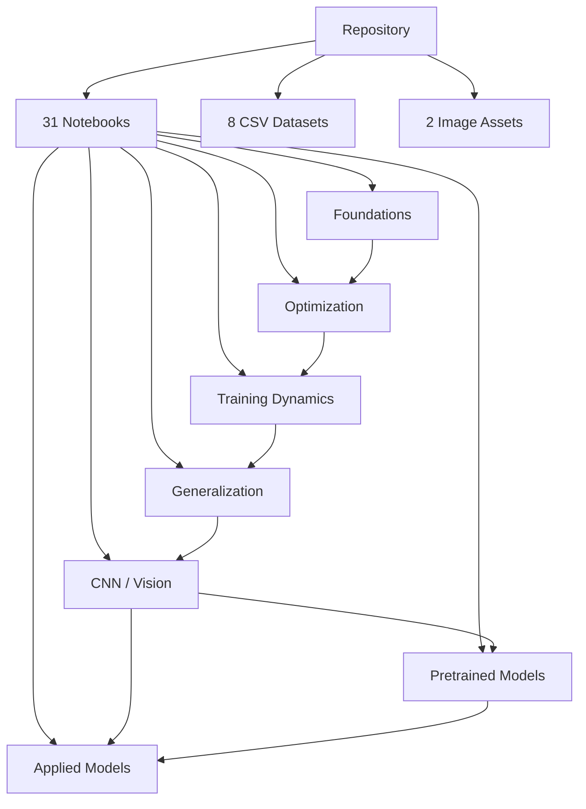

---

# Repository Structure

The repository keeps notebooks and datasets easy to discover from the root, while supporting files are separated into dedicated directories.

```text
Deep-learning-notebooks-and-datasets/
│
├── *.ipynb                         # 31 learning notebooks
├── *.csv                           # 8 datasets
├── doggo.jpg
├── kitty-cat-kitten-pet-45201.jpeg
│
├── visualizations/
│   ├── dataset visualizations
│   ├── repository-overview.svg
│   └── learning-coverage.svg
│
├── scripts/
│   └── validate_repository.py
│
├── .github/
│   └── workflows/
│       └── validate-repository.yml
│
├── requirements.txt
├── LICENSE
└── README.md
```

The README provides the conceptual organization while the physical repository remains intentionally simple, so every notebook can be opened directly from GitHub or Google Colab.

---

# Repository Philosophy

> **Don't just learn how to use a model. Learn what the model is doing.**

The notebooks cover both **low-level intuition** and **higher-level frameworks**.

That makes the repository useful for:

- Students learning deep learning
-  Developers building ML foundations
- Experimentation and rapid prototyping
- Exam and interview revision
- Understanding neural-network internals
- Revisiting important deep-learning concepts

---

# Quick Navigation

| I want to... | Start here |
|:---|:---|
| Learn in the intended order | [What You Will Learn](#what-you-will-learn) |
| Browse every notebook | [Notebook Atlas](#notebook-atlas) |
| Explore the datasets visually | [Visual Data Atlas](#visual-data-atlas) |
| Understand the dataset inventory | [Dataset Directory](#dataset-directory) |
| Run locally or in Colab | [Run It](#run-it) |
| Reproduce the environment | [Reproducibility](#reproducibility) |
| Understand contribution standards | [Project Documentation](#project-documentation) |

---

# Author

<div align="center">

### Ritesh Kumar

**Computer Science Engineering | Machine Learning | AI | Data Science**

<a href="https://github.com/RITESH2127">
 
</a>

</div>

---

<div align="center">

### If this repository helps you understand deep learning, consider starring it.

**Learn -> Experiment -> Visualize -> Build -> Repeat**

</div>

---

<sub>Repository inventory and documentation verified against the current main branch on September 20, 2026.</sub>
